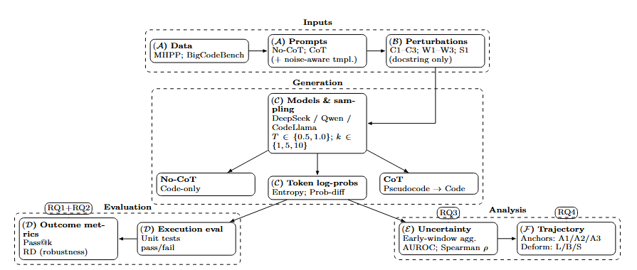

# CoT
The repository contains the detailed results and replication package for the paper "Structural Anchors and Reasoning Fragility: Understanding CoT Robustness in LLM4Code".

## Introduction

Our proposed approach of our experiments and our research questions:



We use this repository to answer following research questions:

RQ1: Do LLM4Code models consistently achieve better performance when using Chain-of-Thought (CoT)?

RQ2: Does CoT improve the robustness of LLM4Code models under perturbed prompts?

RQ3: Is early-stage uncertainty in the generation process predictive of final code-generation failure?

RQ4: How do input perturbations affect the structure of CoT reasoning trajectories?

## Setup
First, install Python dependencies:
```console
pip install -r requirements.txt

git clone git@github.com:THUDM/CodeGeeX.git
cd CodeGeeX
pip install -e .
```

## Evaluation
we consider the following benchmarks:
```console
# Qwen, MHPP, nocot
python ./src/programmer_mhpp.py \
  --model_path Qwen/Qwen2.5-Coder-7B-Instruct\
  --dataset_file ./src/dataset/MHPP.jsonl \
  --prompt_path ./prompts/mhpp_prompt_nocot.txt \
  --run_tag nocot

# Qwen, MHPP, cot
python ./src/programmer_mhpp.py \
  --model_path Qwen/Qwen2.5-Coder-7B-Instruct\
  --dataset_file ./src/dataset/MHPP.jsonl \
  --prompt_path ./prompts/mhpp_prompt_cot.txt \
  --run_tag cot
```

## Datasets
This dataset contains the unperturbed datasets [`MHPP`](src/dataset/MHPP.jsonl), [`BCB`](src/dataset/BCB.jsonl) and 14 perturbed datasets are constructed within this work. (see [Section 4 in our paper] for more details).

